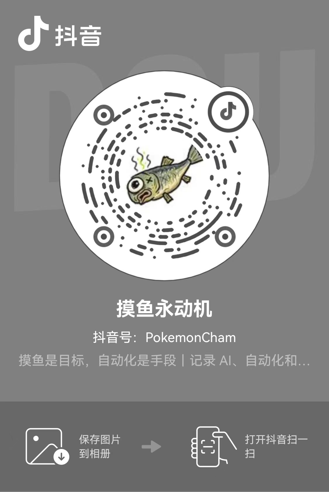

# Tibo重置助手 / Tibo Reset Assistant

一个可以自行部署的 Codex 重置公告追踪网站：保存 Tibo 的公开 X 正文与原页面截图，用自己的 Codex 账号完成翻译、摘要和重置分析，再由程序校验结果、更新公告与观察窗口。

[在线示例](https://codex-reset.top/) · [更新日志](CHANGELOG.md) · [接入自己的 Codex 账号](docs/CODEX-SETUP.md) · [部署与故障排查](docs/DEPLOYMENT.md) · [联系作者与小程序](#联系作者与小程序)

**UI 视觉设计参考 [Codex Resets](https://codex-resets.com/)，本项目的页面业务、采集与服务逻辑为独立编写，未使用参考网站的源码。** 第三方依赖及素材的许可说明见 [NOTICE](NOTICE.md)。


## 下载后启动

需要 **Node.js 22.13+（自带 npm）和 Python 3.10+**。首次启动联网安装锁定的依赖并构建页面；网页、API 和数据存储运行在自己的机器上。

```sh
git clone https://github.com/fehuing/tibo-reset-assistant.git
cd tibo-reset-assistant
npm start
```

打开 **http://localhost:8080/**，按 Ctrl+C 停止。也可运行 `python run.py`（Linux/macOS 使用 `python3 run.py`）。已有构建时用 `npm start -- --no-build` 跳过安装和构建。

默认使用仓库中的 **2026-09-13 历史快照**，页面明确标注，不自动采集 X、不调用模型，也不需要第三方账号。快照保留原采集时间，**它不是当前实时结果**。互动计数从本实例的 0 开始，不导入在线站点的用户投票。已有 `.data/` 不会在更新代码时被快照覆盖。

安装 Docker Compose 后，也可以运行：

```sh
docker compose up --build -d
```

同样打开 http://localhost:8080/。默认仅绑定本机地址，数据保存在 `tibo-data` volume；普通重启不会清空数据。默认轻量镜像用于网页和 API，AI 接入建议先使用下面的宿主机方式。

## 接入自己的 Codex 账号

新版已包含完整 AI 管线。先安装截图依赖和 Chromium，再安装官方 Codex CLI，并用**运行后台服务的同一个系统用户**登录。完整安装、设备码授权、网络配置和错误处理见 [Codex 接入指南](docs/CODEX-SETUP.md)。

```sh
# 在运行项目的 Python 环境中安装；需要时先创建虚拟环境
python -m pip install -r requirements-capture.txt
python -m playwright install chromium

# 已安装官方 Codex CLI 后，在服务器上完成设备码授权
codex login --device-auth
codex login status

# 自动启用公开动态采集、原页面截图和 AI 分析
npm start -- --ai
```

有浏览器的本机可使用 `codex login`。Linux 缺少浏览器系统库时，按指南安装 Chromium 的系统依赖。

**模型请求通过云端处理，需要网络、账号权限和可用额度；不是本地离线推理。** 默认模型是 `gpt-6-astra`，应根据自己账号实际可用的模型设置 `CODEX_MODEL`。登录成功不代表已获得某个模型的权限。项目通过 CLI 进程调用 `codex exec`，不要求把 ChatGPT 登录凭据粘贴成 API key。

## 三种运行方式

| 启动命令 | 数据处理 | 所需条件 |
| --- | --- | --- |
| `npm start` | 已标注的历史快照、本地网页与 API | Node.js、Python；首次安装需要网络 |
| `npm start -- --ai` | 公开 X 采集、原图归档、Codex 翻译与分析、校验发布 | Chromium、Codex CLI、账号权限和可访问相关服务的网络 |
| `npm start -- --live` | 保留旧版规则采集方式，显式选择后启用 | 可访问公开 X 页面的网络 |

AI 模式失败会保留已有数据、记录错误并重试，**不会自动退回关键词规则来代替模型判断**。旧模式可另加 `--capture` 采集新截图、`--translate` 使用自行配置的翻译服务；AI 模式会拒绝同时开启旧翻译选项。参考站接口回退默认关闭，详见 [部署说明](docs/DEPLOYMENT.md)。

切换模式前请检查 `.env`：若已有 `AI_ANALYSIS=1`，单加 `--live` 不会关闭 AI；切回旧规则前应先将它设为 `0`。

## 最近的更新

- **采集与分析分开。** 先存公开正文、上下文和 X 原页面截图，再排队调用 Codex。保留完整中文翻译和中英文摘要，不再需要浏览器翻译截图。
- **标准结果经过校验才发布。** 检查 JSON 结构、来源 ID、正文哈希、引用依据和关联关系；普通动态只归档与翻译，个人使用重置卡、个人周期重置不计作全局事件。
- **公告更简洁。** 头像气泡展示，默认最新三条，其余折叠；详情保留全文、原始 X 截图和分享。后台保留判定与关联数据，列表不逐条展示分析标签。
- **观察覆盖预告到重置的空档期。** 新观察在经校验的线索、预告或进行中消息出现后开启，确认或取消后关闭，不再仅因满 24 小时结束。预测和社区投票都不等于已发放。
- **日历与实际时间分别处理。** 已验证的旧日历数据对齐参考站，保留最近 26 周、北京时间的布局；首页在有已核实数据时展示实际重置时间，不把发帖时间自动当作到账时间。
- **错误可见。** 区分 X 网络、访问限制、解析问题和模型登录、额度、超时、结果校验问题；失败保留旧数据与真实成功时间，后续重试。
- **保留原有功能。** 中文 / English 切换、浅色 / 深色模式、手机宽度适配、SQLite 持久化求重置与观察投票。

公开 X 页面可能要求登录、限制访问或遗漏回复、转发和分页内容，**不保证实时性或完整覆盖**。能打开网站，不代表部署服务器能访问 X。项目不读取访问者的 Codex 余额；公开文字明确宣布完成，也不是对每个账户到账情况的测量。

## 定制与开发

- 复制 `.env.example` 为 `.env` 配置端口、站点地址、采集和 AI 选项；构建参数变更后重新运行 `npm start`。
- `lib/site-config.ts`：部署者可选的小程序码和联系码，默认留空。作者联系方式只展示在仓库文档，不自动添加到部署者网页。
- `app/page.tsx`、`components/`：页面与组件；`app/globals.css`：样式；`lib/i18n.ts`：中英文文案。
- `ops/ai_role.md`、`ops/ai_analysis.schema.json`：模型角色与输出结构；`ops/`：采集、分析、校验和发布逻辑。
- `.data/`：实例数据、SQLite、归档和私有配置；`.data/ai-input/` 与 `.data/ai-analysis/` 保存模型输入、状态与结果。不要提交 Git。

```sh
npm ci
npm test
npm run typecheck
npm run build
python scripts/smoke.py
```

热更新开发：先运行 `npm start -- --no-build` 保持本地 API，再在另一个终端运行 `npm run dev`，访问 http://localhost:4175/radar/。开发服务器将数据、截图和投票请求转发到本机 8080 端口。

依赖通过 `package-lock.json` 和 `requirements-capture.txt` 锁定；不上传与操作系统相关的 `node_modules`、虚拟环境、Codex 登录缓存和浏览器二进制。截图和 CLI 按实际运行环境安装。

这是**网页版开源仓库**，包含网页和独立运行的后端。微信小程序源码、线上服务器凭据、运行数据库和内部部署记录不在此仓库中。下方素材由作者授权公开，仅用于仓库说明展示。

## 联系作者与小程序

作者：**摸鱼永动机**。抖音号：**PokemonCham**，公众号：**aicodexxx**，分享 AI、自动化和项目开发记录。

[打开作者的抖音主页](https://www.douyin.com/user/MS4wLjABAAAAgKEIN1i2djS40akFCL0eHusrxGpZkN5HalkAZG-DHOs)

| Tibo重置助手小程序 | 微信联系作者 |
| --- | --- |
| <a href="docs/assets/tibo-miniprogram-code.png"></a> | <a href="docs/assets/wechat-contact-code.png"></a> |

| 抖音：摸鱼永动机 | 公众号：aicodexxx |
| --- | --- |
| <a href="docs/assets/douyin-code.jpg"></a> | <a href="docs/assets/wechat-official-account-code.png"></a> |

点击图片查看原图。微信联系码用于添加好友，公众号码用于关注公众号，均不是收款码。

## 自愿支持

自有源代码按 MIT 开源，使用开源功能不需要向作者付款。欢迎 Star、提交问题或分享项目。自行部署使用的服务器、网络与模型服务可能产生相应费用。

后续若开放打赏，将在本 README 补充自愿支持方式；金额自选，不承诺重置额度或额外权益。**目前暂未开放打赏，仓库未发布收款二维码。**

## English quick start

Install Node.js 22.13+ and Python 3.10+, clone this repository, then run `npm start`. The launcher installs locked npm dependencies, builds the web app and starts a local Python/SQLite API at http://localhost:8080/. `docker compose up --build -d` is another way to run the default snapshot mode.

The default is an explicitly labelled September 13, 2026 historical snapshot. It does not collect X or call a model. Your instance starts with its own zeroed counters.

For the new AI pipeline, install the capture requirements and Chromium, install the official Codex CLI, authenticate as the same operating-system user that runs the service, then run `npm start -- --ai`. See the [account setup guide](docs/CODEX-SETUP.md). The default `CODEX_MODEL=gpt-6-astra` requires access from your account. The app and storage are self-hosted; model inference uses the cloud and your account's available limits. AI errors retain existing data and retry, without silently switching to the legacy rule classifier. `--live` explicitly selects the legacy collection mode.

Announcements show three items by default. New watch windows remain open until confirmation or cancellation. Forecasts and votes are not delivery evidence. Public X access is best effort and can omit posts or replies; no visitor's personal Codex balance is read. Keep authentication caches, private configuration and runtime data out of Git.

## 许可与致谢

本项目自有代码采用 [MIT License](LICENSE)。React、组件库等第三方依赖各自保留许可证；公开推文、截图、头像和第三方标识不纳入本项目的 MIT 授权，权利属于其原权利人，详见 [NOTICE](NOTICE.md)。本项目不是 OpenAI、X 或 Tibo 的官方产品。
